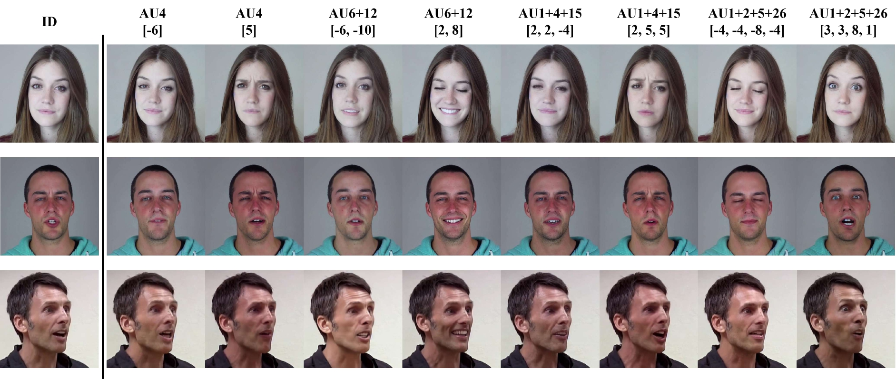

# MagicFace Model Card

> **注意**: 此儲存庫 (repository) 原始來自 [https://github.com/weimengting/magicface](https://github.com/weimengting/magicface)

<div align="center">

[**Paper**](https://arxiv.org/pdf/2501.02260) **|** [**Code**](https://github.com/weimengting/MagicFace) 


</div>

## Introduction
MagicFace is an efficient and effective facial expression editing model conditioned on facial action units (AU).
It provides a more flexible, user-friendly, and highly interpretable method for editing expressions.


<p align="center">
  
</p>

## Usage

You can directly download the model in this repository or download in python script:

```python
# Download a specific file
from huggingface_hub import hf_hub_download
hf_hub_download(repo_id="mengtingwei/magicface", filename="79999_iter.pth", local_dir="./utils")
# Download all files 
from huggingface_hub import snapshot_download
snapshot_download(repo_id="mengtingwei/magicface", local_dir="./")
```